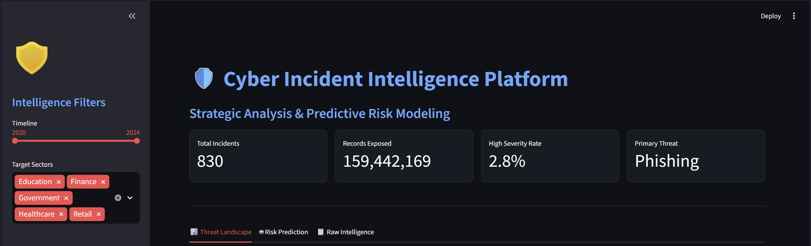
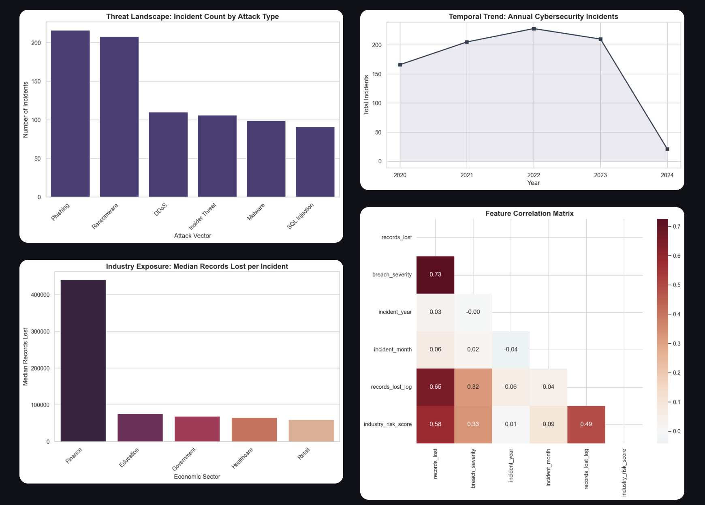
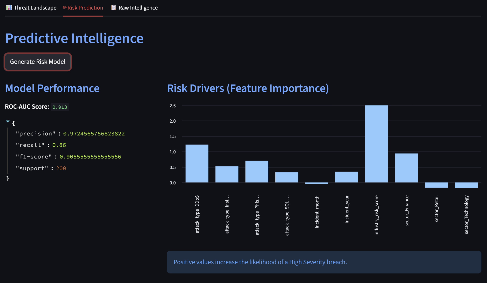

# Cyber Incident Intelligence Platform
🛡️ A cybersecurity analytics platform for threat intelligence and risk prediction

## Overview

The **Cyber Incident Intelligence Platform** is an end-to-end analytics and machine learning system that transforms raw cybersecurity incident data into actionable intelligence.

It enables security analysts and decision-makers to understand attack patterns, measure organizational risk exposure, and predict the likelihood of high-severity breaches using statistical analysis and machine learning.

It performs:

- Exploratory data analysis (EDA)
- Statistical testing
- Feature engineering
- Predictive modeling (logistic regression)
- Interactive visualization via a Streamlit dashboard

The goal is to transform raw breach data into **actionable security intelligence**.

## Business Impact

The Cyber Incident Intelligence Platform helps organizations:

- Identify high-risk sectors vulnerable to cyberattacks  
- Understand how attack patterns evolve over time  
- Quantify data exposure from cybersecurity incidents  
- Predict breach severity using machine learning  
- Support proactive cybersecurity decision-making  

**This transforms raw data into actionable security intelligence**

## Key Questions

- **Threat landscape**
  - What attack types are increasing over time?
  - Which industries experience the most incidents?
  - Which attack methods are most damaging?

- **Risk exposure**
  - Which sectors lose the most records?
  - Which attack vectors cause the largest breaches?

- **Predictive insights**
  - Can we predict breach severity based on incident attributes?

- **Strategic intelligence**
  - What trends should organizations prepare for?

## Tech Stack

- **Python** (pandas, numpy, scipy)  
- **Machine Learning** (scikit-learn)  
- **Visualization** (matplotlib, seaborn)  
- **Dashboard** (Streamlit)  
- **Configuration** (YAML)  

## Pipeline

1. **Data pipeline** (`src/data/data_pipeline.py`)
   - Load raw CSV or generate sample data (`generate_data.py`)
   - Clean data, handle missing values, remove duplicates
   - Save processed dataset

2. **Feature engineering** (`src/features/feature_engineering.py`)
   - `breach_severity`
   - `incident_year`
   - `records_lost_log`
   - `industry_risk_score`

3. **Exploratory analysis** (`src/analysis/exploratory_analysis.py`)
   - Attack distribution
   - Sector incident counts
   - Yearly trends
   - Correlation matrix

4. **Statistical tests** (`src/statistics/statistical_tests.py`)
   - Chi-square test: attack type vs sector
   - Pearson correlation tests

5. **Modeling** (`src/models/risk_prediction.py`)
   - Logistic regression to predict high-severity breaches

6. **Visualization** (`src/visualization/visualization.py`)
   - Attack type distribution
   - Incidents over time
   - Sector risk comparison
   - Correlation heatmap

7. **Dashboard** (`app/dashboard.py`)
   - Streamlit app for interactive exploration

## System Architecture

Raw Data → Cleaning → Feature Engineering → ML Model → Dashboard

A modular pipeline that transforms raw cybersecurity data into predictive intelligence through preprocessing, feature engineering, and machine learning.

## Dashboard Preview





## Installation

```bash
git clone https://github.com/ysf-sheikh/cyber-incident-intelligence-platform.git cyber-incident-intelligence
cd cyber-incident-intelligence
python -m venv venv
source venv/bin/activate  # Windows: venv\Scripts\activate
pip install -r requirements.txt
pip install -e .
```

## Usage

### Optional: Generate sample data
If you don’t have a real dataset, you can generate a mock dataset using:
```bash
python src/data/generate_data.py
```
The generated dataset includes:
- **incident_date** – date of the incident (2020–2024)
- **sector** – e.g., Finance, Healthcare, Retail, Government, Education, Technology
- **attack_type** – e.g., Ransomware, Phishing, SQL Injection, DDoS, Insider Threat, Malware
- **records_lost** – number of records compromised (follows a skewed distribution; Finance incidents tend to have higher losses, and recent incidents favor Ransomware/Phishing)

### 1. Run the Data Pipeline
Process the raw data and generate engineered features:
```bash
python main.py
```

### 2. Launch the Intelligence Dashboard
Start the interactive Streamlit interface:
```bash
streamlit run app/dashboard.py
```